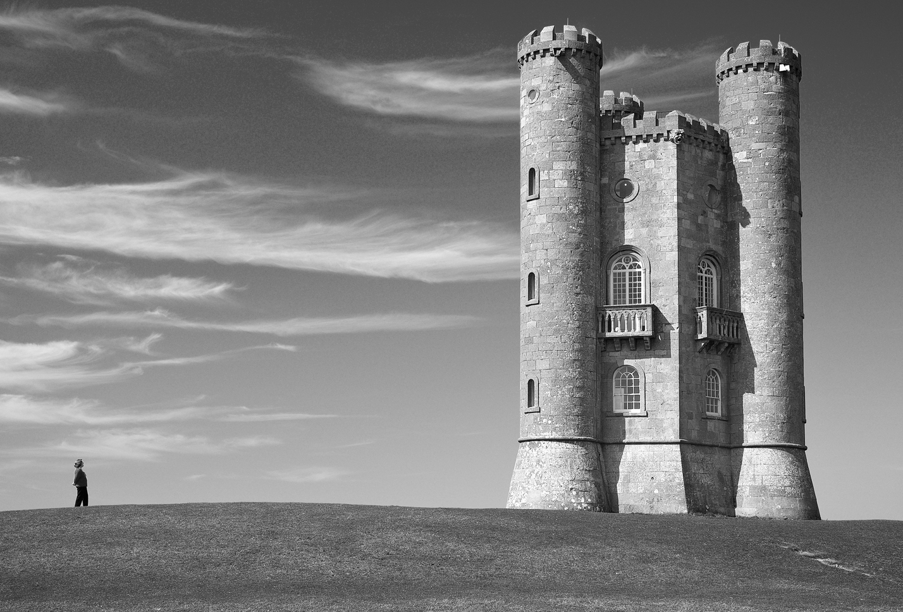

```{r setup, include=FALSE}
knitr::opts_chunk$set(cache=TRUE)
knitr::opts_chunk$set(message = FALSE)
```

# Installation and requirements

See the [dedicated file](../requirements.md).

Specific requirements for the tutorial:
```{r lib, eval=FALSE}
install.packages("jpeg")
```

# Sparse Non-negative Matrix factorization

## Introduction

**Notation**: $X = [x_{ij}]\in\mathbb{R}^{n \times p}$, $U = [u_{ik}]\in\mathbb{R}^{n \times K}$, $V = [v_{jk}]\in\mathbb{R}^{n \times K}$

1. **Matrix factorization problem**:

- given a data matrix $X$ of dimension $n \times p$

- the objective is to find two matrices $U$ of dimension $n \times K$ and $V$ of dimension $p \times K$ such that $UV^t$ approximates $X$ for a given latent dimension $K$

- the approximation between $X$ and $UV^t$ can be done for instance with the Frobenius norm:
\[
\Vert X - UV^t \Vert_2^{\,2} = \sum_{i=1}^n \sum_{j=1}^p \Big(x_{ij} - \sum_{k=1}^K u_{ik} v_{jk} \Big)
\]


2. **Optimization problem**:
\[
\underset{U\in\mathbb{R}^{n \times K},V\in\mathbb{R}^{n \times K}}{argmin}\ \Vert X - UV^t \Vert_2^{\,2} + \lambda_1 P_1(U)  + \lambda_2 P_2(V)
\]
- with potential penalty functions $P_1$ and $P_2$ on $U$ and $V$ respectively.


3. **Non-negative matrix factorization** (NMF):

- specific matrix factorization methods with a specific constraints of non-negativity ($\geq 0$) on the elements of the factor matrices $U$ and $V$

- particularly suitable to decompose data matrix with non-negative coordinates


4. **Sparse matrix factorization**:

- matrix factorization problem with specific constraints or penalization to enforce sparsity on factor matrices $U$ and/or $V$


5. **Matrix factorization can be used for**:

- dimension reduction
- latent space projection/embedding
- data compression
- and more

---

# Exercise

## Data

We are going to use a matrix factorization algorithm algorithm to compress an image (from wikimedia.org).

```{r img, message=FALSE, warning=FALSE, echo=FALSE, fig.align='center', out.width = '80%'}

```

An image is an array of dimension `width x height x channels`.

Here, we have a grey-scale image (each pixel is a grey level between 0 and 1) hence we can use only a single channel and represent our image as a matrix `width x height`.

**Hint**: you can use the function `readJPEG` from the R package `jpeg` to read the image as an array in R.


## Work

Use the sparse NMF implemented in `SPAMS` to compress an image.

**Hint**: see the function `spams.nmf`.

**Solution**: see the file [`tuto_spams.R`](./tuto_spams.R`).

---

# And more

Explore the examples in the doc (http://spams-devel.gforge.inria.fr/doc-R/html/index.html).

